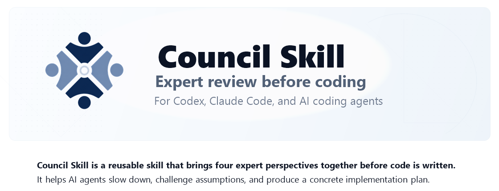

<p align="center">
  
</p>

# Council Skill for AI Coding Agents

[](https://github.com/saroo98/council-skill/actions/workflows/ci.yml)
[](https://github.com/saroo98/council-skill/actions/workflows/pages.yml)

Council is a reusable AI coding skill for Codex, Claude Code, and other AI coding agents. Invoke `/council` to run a practical expert review before implementation, refactoring, redesign, debugging, architecture decisions, or high-stakes product tradeoffs.

Use Council when you want an AI agent to slow down, challenge weak assumptions, and produce a concrete implementation plan before writing code. It is designed for software teams, solo developers, product builders, and agent workflows that need more than a quick answer.

Council is not four real independent humans and does not create separate agents by default. It is a structured review protocol that makes a coding agent evaluate work through four useful lenses: domain/product reality, UI/UX quality, software architecture, and QA/security/operations.

Repository: [github.com/saroo98/council-skill](https://github.com/saroo98/council-skill)

Website: [saroo98.github.io/council-skill](https://saroo98.github.io/council-skill/)

## Why Use It

Most AI coding agents can move fast, but speed can hide product, design, architecture, security, performance, and operations risks. Council adds a lightweight review step for decisions that should not be handled as a one-shot prompt.

Council is practical, not philosophical. It should produce specific objections, tradeoffs, affected files, tests to run, rollout notes, and a final decision. It is especially useful when a technically correct solution might still fail in real workflows.

## When To Use

- Planning a feature before implementation
- Reviewing a redesign before building it
- Choosing between architecture options
- Refactoring code with product or operational risk
- Debugging a tricky issue with unclear root cause
- Reviewing workflows in specialized industries such as healthcare, legal, finance, education, logistics, retail, or internal operations
- Asking Codex or Claude Code for a multi-role critique before coding
- Checking AI-generated implementation plans for missing tests, security issues, rollback gaps, or UX problems

## When Not To Use

- Trivial syntax fixes
- Simple one-file edits with obvious behavior
- Pure formatting changes
- Tasks where the user only wants immediate mechanical execution
- Requests that need authoritative legal, medical, financial, or compliance advice

## Install For Codex

```bash
git clone https://github.com/saroo98/council-skill.git
cd council-skill
./install-codex.sh
```

This installs the skill to:

```text
$HOME/.agents/skills/council
```

## Install For Claude Code

```bash
git clone https://github.com/saroo98/council-skill.git
cd council-skill
./install-claude.sh
```

This installs the skill to:

```text
$HOME/.claude/skills/council
```

## Install Both

```bash
git clone https://github.com/saroo98/council-skill.git
cd council-skill
./install-both.sh
```

The install scripts back up an existing destination folder with a timestamp before replacing it.

## Invocation

```text
/council
```

Some Codex environments also support dollar-prefixed skill prompts:

```text
$council
```

## Example Prompts

```text
/council

Industry: dental clinic management software.
Task: Review the appointment booking redesign before implementation.
```

```text
/council

Industry: legal case-management software.
Task: Review this dashboard architecture before implementation.
```

```text
/council

Industry: warehouse operations.
Task: Decide whether to refactor the pick-list allocation flow now or after the inventory sync bug is fixed.
```

```text
/council

Industry: fintech onboarding.
Task: Review this KYC workflow redesign for product, UX, architecture, security, and rollout risk.
```

## Expected Output Shape

Council outputs:

1. Task restatement
2. First-pass expert review
3. Cross-correction round
4. Synthesis
5. Implementation plan
6. Final decision

The final decision ends with:

```markdown
- **Decision:** ...
- **Confidence:** Low / Medium / High
- **Blocking questions:** ...
- **Next action:** ...
```

## What The Expert Council Reviews

Council uses four default perspectives:

- **Domain/Product Expert:** Real workflows, business rules, operational constraints, user expectations, and domain-specific edge cases.
- **Principal UI/UX Designer:** Interaction design, information architecture, accessibility, usability, visual hierarchy, copy, and design quality.
- **Principal Software Architect:** Architecture, data flow, API design, state management, maintainability, dependencies, implementation complexity, and code quality.
- **QA/Security/Ops Lead:** Tests, regressions, security, privacy, performance, observability, deployment, rollback, and failure modes.

It may add one temporary specialist only when needed, such as a Data/AI Specialist, Compliance/Privacy Specialist, Growth/Business Specialist, or Content/Localization Specialist.

## Common Search Terms

Council may be useful if you are searching for:

- Codex skill for architecture review
- Claude Code skill for software planning
- AI coding agent expert review
- AI agent council for code review
- Multi-role critique before coding
- Software architecture decision prompt
- AI-assisted product and engineering review

## FAQ

### Is Council a Codex skill?

Yes. Council installs to `$HOME/.agents/skills/council` and can be invoked as `/council` in compatible Codex skill environments.

### Is Council a Claude Code skill?

Yes. Council installs to `$HOME/.claude/skills/council` and can be invoked as `/council` in compatible Claude Code skill environments.

### Does Council create real subagents?

No. This repository is an instruction-only skill. It gives one AI coding agent a structured expert review protocol. It does not create real independent agents unless a separate environment explicitly adds that capability.

### Is Council for code review or planning?

Both. Council is useful before implementation, during architecture decisions, before risky refactors, while debugging unclear issues, and when reviewing product or UX changes before code is written.

## Safety And Limitations

Council improves review discipline, but it does not guarantee correctness. It can still miss things, misunderstand context, or overfit to incomplete information.

Users should verify important claims against source code, logs, tests, schemas, official documentation, and real user workflows. Run the relevant checks before shipping.

Council should not be treated as legal, medical, financial, or compliance authority. For regulated or high-stakes decisions, use it as a preparation aid and get qualified review.

## Contributing And Security

- See [CONTRIBUTING.md](CONTRIBUTING.md) for local checks and contribution guidelines.
- See [SECURITY.md](SECURITY.md) for private vulnerability reporting guidance.
- See [docs/forward-tests.md](docs/forward-tests.md) for prompt-level skill validation scenarios.
